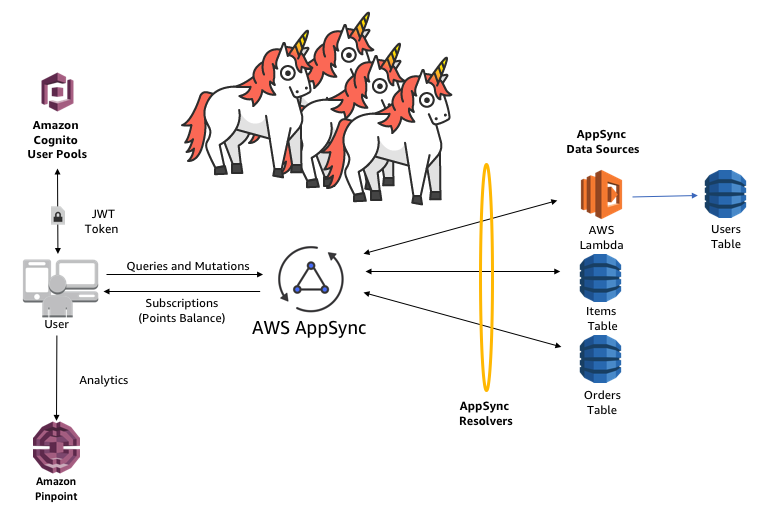
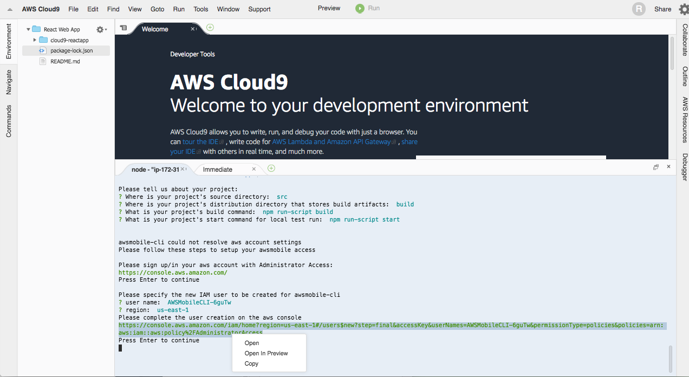
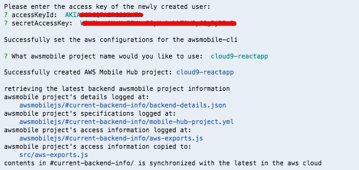
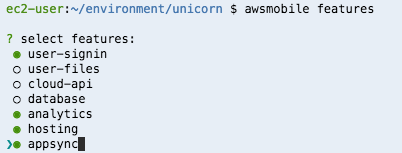
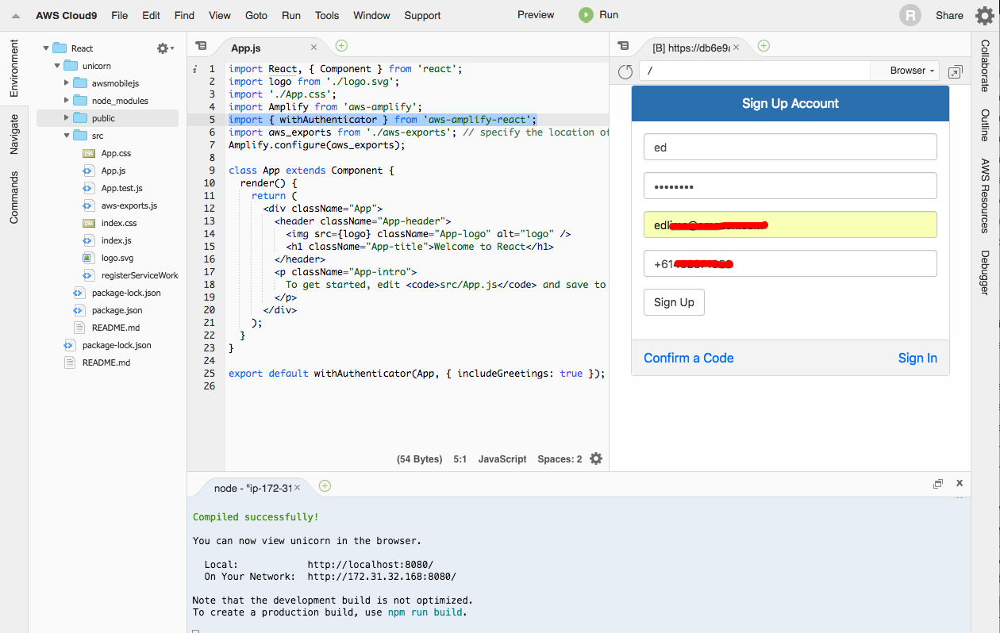
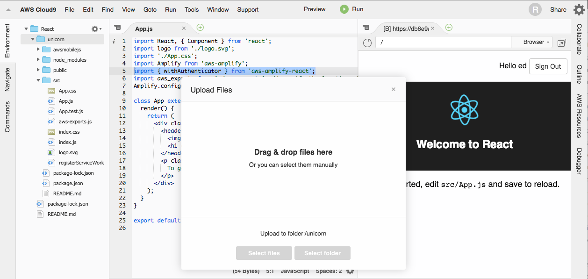
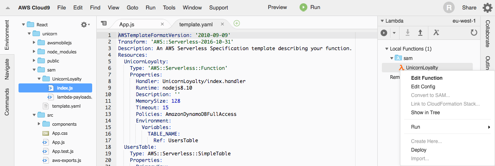
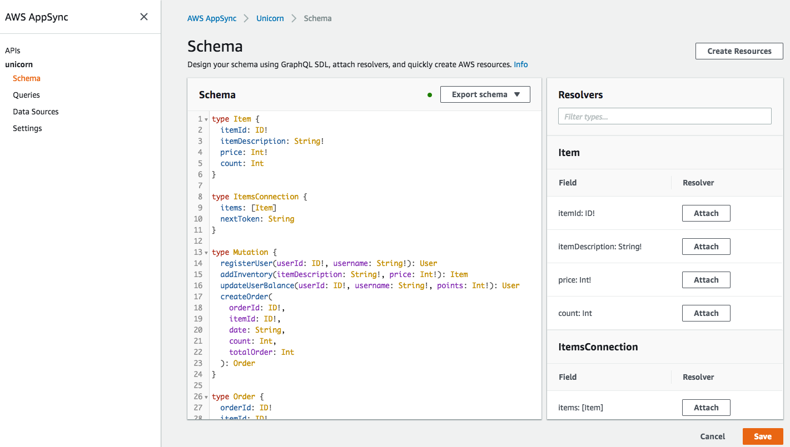
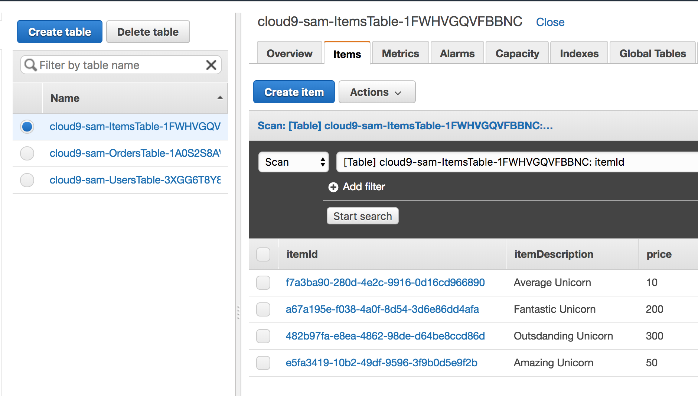
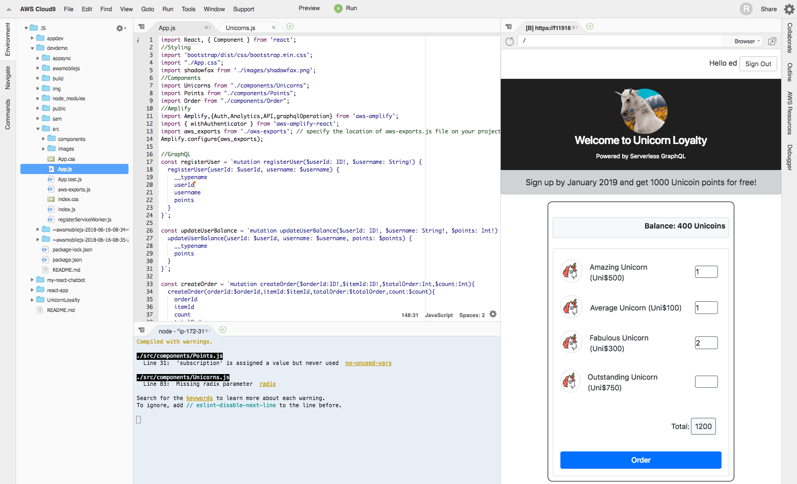

## Unicorn Loyalty: E-Commerce Serverless GraphQL Loyalty Sample App

Unicorn Loyalty is a new startup that provides fantastic unicorns for customers. The business just started and it's giving away 1000 Unicoin Points for new customers to purchase the unicorns available on inventory.

### Behind the Scenes



* AWS AppSync
* AWS Lambda
* Amazon DynamoDB
* Amazon Cognito User Pools
* Amazon Pinpoint
* No Servers!

#### Prerequisites

* [AWS Account](https://aws.amazon.com/mobile/details) with appropriate permissions to create the related resources
* [NodeJS v8.10+](https://nodejs.org/en/download/) with [NPM](https://docs.npmjs.com/getting-started/installing-node)
* [AWS Mobile CLI](https://github.com/aws/awsmobile-cli) `(npm install -g awsmobile-cli)`
* [AWS Amplify](https://aws.github.io/aws-amplify/media/react_guide) `(npm install -g aws-amplify-react)`
* [create-react-app](https://github.com/facebook/create-react-app) `(npm install -g create-react-app)`

#### Optional

* [AWS Cloud9](https://aws.amazon.com/cloud9/) :
We assume you are using Cloud9 to build this application. You can optionally choose to use any IDE/Text Editor such as Atom or VS Code, in that case you should use the [AWS SAM CLI](https://github.com/awslabs/aws-sam-cli) to deploy Lambda and the DynamoDB tables.

### Initial Setup - Mobile CLI and Amplify

Create a Cloud 9 environment and execute:

    $ create-react-app unicorn-loyalty
    $ cd unicorn-loyalty


Install and use the latest LTS Node version:


    $ nvm i v8


Set up your AWS resources with the AWS Mobile CLI:


    $ awsmobile init


Chose the default options, make sure you are logged in with a user that has administrator access and click the resulting link to create an IAM user for the Mobile CLI by selecting OPEN: 



Follow the steps in the IAM Console with default options then use the generated credentials to configure the access in the Mobile CLI:



Now let's add the features we need for our application (User Sign In, Analytics, Hosting and AppSync):



Execute the following command to commit the changes:

    $ awsmobile push

To test if everything is working, open App.js and let's add 4 extra lines of code to add AuthN/Z with MFA (withAuthenticator HOC). Replace the existing code with:

```javascript
import React, { Component } from 'react';
import './App.css';
import Amplify from 'aws-amplify';
import { withAuthenticator } from 'aws-amplify-react';
import aws_exports from './aws-exports'; // specify the location of aws-exports.js file on your project
Amplify.configure(aws_exports);

class App extends Component {
  render() {
    return (
      <div className="App">
        <header className="App-header">
          
          <h1 className="App-title">Welcome to React</h1>
        </header>
        <p className="App-intro">
          To get started, edit <code>src/App.js</code> and save to reload.
        </p>
      </div>
    );
  }
}

export default withAuthenticator(App, { includeGreetings: true });
```
Now execute:


    $ awsmobile run


Then click on PREVIEW -> PREVIEW RUNNING APPLICATION on Cloud9 and sign up a user:



Download all files from the Github repo. Upload them to your Cloud9 workspace (FILE -> UPLOAD LOCAL FILES), overwriting the files in the local React app folder:



### Lambda Setup

From Cloud9 select the AWS Resources tab on the right, you'll find a local Lambda funcion under the "sam" folder called "UnicornLoyalty". Right click and select EDIT CONFIG to check the related SAM template and EDIT FUNCTION to check the Lambda code:



By default the 1000 Unicoins give away special is valid until the last day of 2018. Edit the expiry date accordingly if you want to modify the deadline:

```javascript
let expiry = new Date('2018.12.31').getTime() / 1000; 
```

On the same menu click DEPLOY. The SAM Template will deploy a Lambda function and 3 DynamoDB tables. Lambda will interact directly with the Users table by detecting newly registered users to make sure they will only get the 1000 Unicoin Points special before the special expiry date. The other tables will be used directly by AppSync.

### AppSync Setup

The Mobile CLI creates a sample Event API on AppSync by default. We wont use that. Go to the AppSync console and paste the contents of the file "appsync/schema.graphql" in the SCHEMA setion:



Go to DATA SOURCES, delete the 2 tables from the sample. Now create 3 data sources as follows:


Back to Cloud9, execute the following command to retrieve the AppSync changes:

    $ awsmobile pull

Go to the folder "awsmobilejs/backend/appsync" and delete the file "resolvers.json" and the folder "resolver-mappings".

Go to the folder "appsync" in the root of the application directory and copy the file "resolvers.json" and the folder "resolver-mappings" to the previous folder "awsmobilejs/backend/appsync", replacing the deleted files.

Next step is to configure AppSync authentication. Execute the following command and select the options:


    $ awsmobile appsync configure

    ? Please specify the auth type:  AMAZON_COGNITO_USER_POOLS
    ? user pool id:  <User Pools ID>
    ? region:  <Region>
    ? default action:  ALLOW


Execute the following command to commit the changes:


    $ awsmobile push


### Creating Some Unicorns

Open the file "src/aws-exports.js" generated by the Mobile CLI and copy the value of the key "aws_user_pools_web_client_id"to retrieve the App Client ID the Cognito User Pools is using to authenticate AppSync calls.

Go to the AppSync console and select the QUERY section. Click LOGIN WITH USER POOLS,use the client ID ryou just retrieved from "aws-exports.js" and the credentials from the user you signed up earlier. You'll also need to provide a MFA code.

Execute the following GraphQL operation (mutation) to create your first Unicorn:

```javascript
mutation {
  addInventory(itemDescription: "Amazing Unicorn", price: 50){
    itemId
    itemDescription
    price
  }
}
```

Create as many Unicorns as you'd like by changing the values. Going to the DynamoDB console, you can confirm the Unicorns were created successfully:



### Welcome to the Unicorn Loyalty Shop

Back to Cloud9 execute:


    $ awsmobile run


Then click on PREVIEW -> PREVIEW RUNNING APPLICATION to access the Unicorn Loyalty App:



Finally you can publish to CloudFront and S3 with a single command:

    $ awsmobile publish

It will automatically make the Unicorn Loyalty app available in a powerful and reliable global content delivery network backed by a S3 website:


You can also get Analitycs about usage and revenue from Amazon Pinpoint, all thanks to AWS Amplify and the AWS Mobile CLI:

* Usage:


* Revenue:


## License Summary

This sample code is made available under a modified MIT license. See the LICENSE file.
